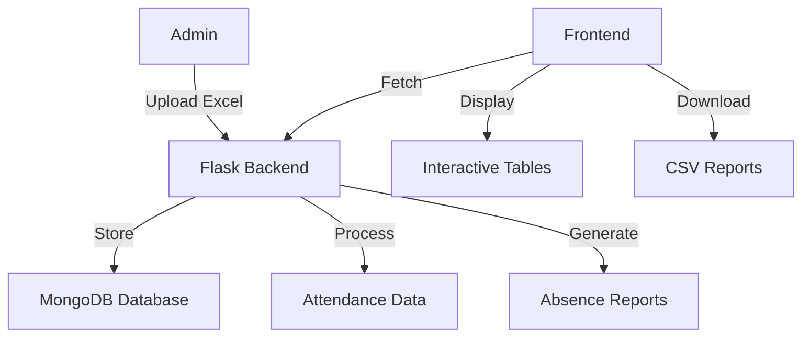
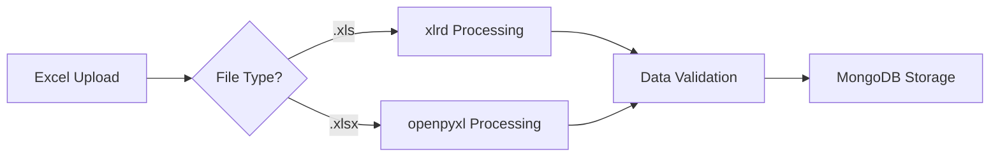
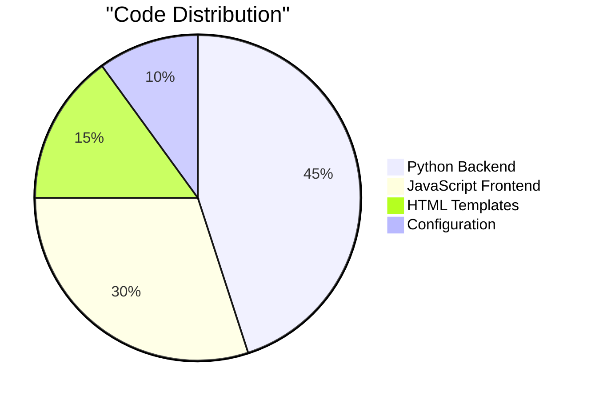

# Mess Attendance System 
## Rajendra Bhawan - IIT ROORKEE

A comprehensive web-based system for managing and analyzing student mess attendance records. The system processes Excel-based attendance data, tracks patterns, and generates detailed reports for consecutive absences.

##  Table of Contents
- [Features](#features)
- [System Architecture](#system-architecture)
- [Tech Stack](#tech-stack)
- [Installation](#installation)
- [Usage](#usage)
- [API Endpoints](#api-endpoints)
- [Data Processing](#data-processing)
- [Security](#security)
- [Screenshots](#screenshots)

##  Features

- **Excel File Processing** 
  - Supports both `.xls` and `.xlsx` file formats
  - Intelligent enrollment number validation
  - Automatic status detection and standardization

- **Attendance Tracking**
  - Historical attendance viewing with date range filtering
  - Interactive attendance status visualization
  - Comprehensive attendance records management

- **Absence Analysis**
  - Consecutive absence detection
  - Configurable absence threshold
  - Downloadable absence reports in CSV format

- **Admin Dashboard**
  - Secure admin authentication
  - User-friendly interface
  - Real-time upload status feedback

##  System Architecture



##  Tech Stack

| Component    | Technology                |
|-------------|---------------------------|
| Frontend    | HTML, CSS, JavaScript     |
| Backend     | Flask (Python)            |
| Database    | MongoDB                   |
| File Processing | openpyxl, xlrd        |
| Authentication | Flask-Login            |
| Date Handling  | python-dateutil        |


## Screenshots & Features

| Description | Screenshot |
|-------------|------------|
| **Admin Upload Page** <br><br> - Simple and intuitive upload interface<br>- Date selector for attendance records<br>- Support for Excel file uploads (.xls and .xlsx)<br>- Clear form layout with labeled fields<br>- Progress feedback for upload status<br>- Secure file handling<br>- User-friendly design with minimal clutter |  |
| **Attendance History Page** <br><br> - Comprehensive view of student attendance records<br>- Date range filtering capability<br>- Color-coded status indicators (green for present, red for absent)<br>- Clear enrollment number display<br>- Day-by-day attendance tracking<br>- Easy-to-read table format with fixed headers<br>- Interactive date selection |  |
| **Absences Report Page** <br><br> - Generates reports of consecutive student absences<br>- Customizable date range selection<br>- Adjustable consecutive days threshold<br>- Displays enrollment number, start date, end date, and total absent days<br>- Downloadable reports in CSV format<br>- Clean, organized tabular view of absence patterns |  |


##  Installation

1. Clone the repository:
```bash
git clone https://github.com/yourusername/mess-attendance-system.git
cd mess-attendance-system
```

2. Create and activate virtual environment:
```bash
python -m venv venv
source venv/bin/activate  # Linux/Mac
venv\Scripts\activate     # Windows
```

3. Install dependencies:
```bash
pip install -r requirements.txt
```

4. Set up environment variables:
```bash
cp .env.example .env
# Edit .env file with your MongoDB URI and secret key
```

5. Run the application:
```bash
python app.py
```

##  Usage

### Admin Portal
1. Login using admin credentials
2. Navigate to Upload section
3. Select date and Excel file
4. Submit for processing

### Viewing Attendance
1. Access History section
2. Select date range
3. View color-coded attendance table
4. Filter and sort as needed

### Analyzing Absences
1. Visit Absences section
2. Set consecutive days threshold
3. Select date range
4. Generate and download reports

## 🔌 API Endpoints

| Endpoint | Method | Description |
|----------|---------|------------|
| `/upload` | POST | Upload attendance Excel file |
| `/api/attendance` | GET | Fetch attendance records |
| `/api/absences` | GET | Get consecutive absence data |
| `/login` | POST | Admin authentication |
| `/logout` | GET | End admin session |

##  Data Processing

### Excel Processing Flow


### Attendance Status Classification
- **Present**: Marked when student attends mess
- **Absent**: Recorded for "not present" status
- **Invalid**: Entries with incorrect enrollment numbers

##  Security

- Session-based authentication
- Environment variable configuration
- Input validation and sanitization
- Secure password handling
- Protected API endpoints

##  Project Statistics



##  Screenshots

> Note: Add actual screenshots of your application here:
- Login Page
- Admin Dashboard
- Attendance History View
- Absence Report Page

##  Future Enhancements

1. Email notifications for long absences
2. Mobile responsive design
3. Student portal access
4. Real-time attendance updates
5. Advanced analytics dashboard

##  Contributing

1. Fork the repository
2. Create feature branch
3. Commit changes
4. Push to branch
5. Open pull request

##  License

This project is licensed under the MIT License - see the [LICENSE](LICENSE) file for details.

---
Utso Sarkar
(Technical Secretary)
Email: utso_s@ma.iitr.ac.in
